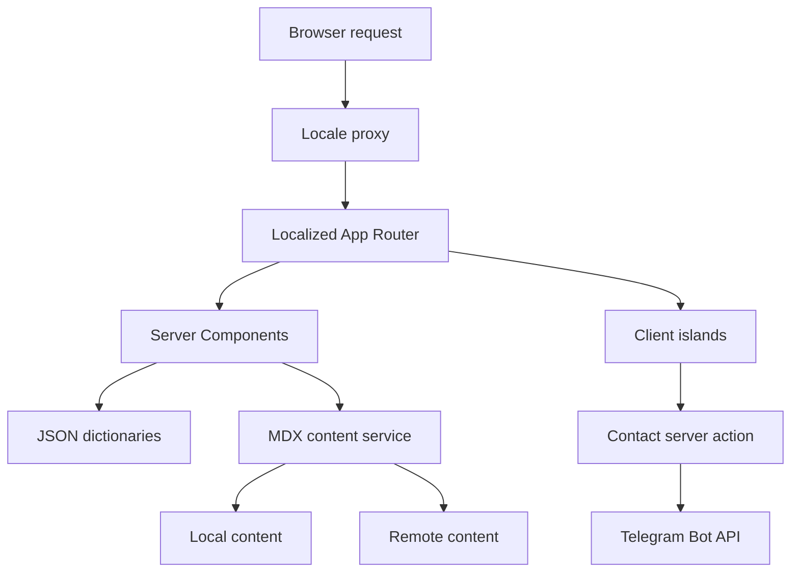

# ghassan.de — Marketing Website

Production portfolio and engineering publication platform for **Ghassan
Aldarwish**, presented as a Backend Developer, DevOps Engineer, and Junior AI
Developer with a focus on scalable systems, cloud infrastructure, and software
architecture.

[Live website](https://ghassan.de) ·
[GitHub profile](https://github.com/ghassanaldarwish) ·
[LinkedIn](https://linkedin.com/in/ghassan-aldarwish)

## Table of contents

- [Overview](#overview)
- [Features](#features)
- [Technology stack](#technology-stack)
- [Architecture](#architecture)
- [Routes and locales](#routes-and-locales)
- [Project structure](#project-structure)
- [Getting started](#getting-started)
- [Environment variables](#environment-variables)
- [Article and MDX system](#article-and-mdx-system)
- [Contact form](#contact-form)
- [SEO and social sharing](#seo-and-social-sharing)
- [Styling, themes, and accessibility](#styling-themes-and-accessibility)
- [Scripts and quality checks](#scripts-and-quality-checks)
- [Documentation guides](#documentation-guides)
- [Deployment](#deployment)
- [Development workflow](#development-workflow)
- [License](#license)

## Overview

This repository contains the source for [ghassan.de](https://ghassan.de). It is
more than a static portfolio: it combines localized marketing pages, detailed
engineering case studies, a hybrid MDX content pipeline, a server-backed
contact form, and a complete SEO layer.

The application uses the Next.js App Router and keeps most rendering and
content work on the server. Client Components are limited to interactive
islands such as navigation, theme controls, animation, and form handling.

## Features

- Localized, locale-prefixed routes powered by `next-intl`.
- English, German, and Arabic dictionaries with automatic RTL document
  direction for Arabic.
- Home, About, Engineering, article detail, Contact, and localized 404 pages.
- Local, remote, or hybrid MDX article loading with runtime validation.
- GitHub-flavored Markdown, syntax highlighting, heading anchors, tables, and
  custom MDX components.
- Responsive light, dark, and system themes with theme-aware brand assets.
- Contact form validation in both the browser and server action, followed by
  Telegram delivery in production.
- Localized metadata, canonical URLs, `hreflang`, sitemap, robots rules,
  JSON-LD, and generated Open Graph/Twitter images.
- Responsive shadcn/Radix UI components, Motion animations, keyboard focus
  treatment, and reduced-motion support.

## Technology stack

| Area               | Technology                                                          |
| ------------------ | ------------------------------------------------------------------- |
| Framework          | Next.js 16 App Router, React 19, TypeScript                         |
| Styling            | Tailwind CSS 4, shadcn/ui, Radix UI, CSS custom properties          |
| Localization       | next-intl                                                           |
| Content            | MDX 3, gray-matter, Zod, remark/rehype plugins                      |
| Code rendering     | rehype-pretty-code, Shiki                                           |
| Forms              | React Hook Form, Zod, `@hookform/resolvers`                         |
| Server integration | Next.js Server Actions, Fetch API, Telegram Bot API                 |
| UI behavior        | Motion, next-themes, Lucide icons, Sonner                           |
| SEO                | Next.js Metadata API, `next/og`, JSON-LD, sitemap and robots routes |
| Tooling            | pnpm 10, ESLint 9, Prettier 3, Vitest, Playwright, Knip             |

The exact dependency versions are recorded in `package.json` and
`pnpm-lock.yaml`.

## Architecture



### Request and rendering flow

1. `src/proxy.ts` applies the `next-intl` routing policy and ensures public page
   URLs always contain a locale prefix.
2. `src/app/[locale]/layout.tsx` validates the locale, loads its dictionary,
   sets `lang` and `dir`, and installs the theme and translation providers.
3. Route-level Server Components load translations, content, and metadata.
4. Interactive behavior is delegated to focused Client Components.
5. Article content is loaded only on the server, validated, compiled, and
   rendered into the localized article route.

### Server and client boundaries

The repository intentionally uses React Server Components by default.

**Server-side responsibilities**

- Route rendering and localized metadata.
- Local and remote MDX discovery and loading.
- Frontmatter validation and draft filtering.
- MDX evaluation and syntax highlighting.
- JSON-LD construction, sitemap generation, and social images.
- Contact form revalidation and Telegram delivery.

**Client-side responsibilities**

- Mobile navigation and locale switching.
- Theme selection, theme-aware logo selection, and the `D` theme shortcut.
- React Hook Form state and validation feedback.
- Toast notifications and dialogs.
- Scroll-aware navigation and decorative animations.

The article server boundaries live in `src/features/articles/server` and
`src/components/mdx/mdx-renderer.tsx` through `server-only`. The contact
mutation is defined as a Server Action in
`src/features/contact/server/submit-contact-form.ts`.

The accepted
[feature-oriented structure ADR](docs/architecture/001-feature-oriented-structure.md)
defines ownership, dependency direction, naming, server-only rules, and the
incremental “move files when touched” policy.

## Routes and locales

The routing strategy uses `localePrefix: "always"`. A request to `/` is handled
by the localization proxy, which negotiates a supported locale and falls back
to English.

| Route                       | Purpose                                        |
| --------------------------- | ---------------------------------------------- |
| `/{locale}`                 | Portfolio home page                            |
| `/{locale}/about`           | Profile, background, and engineering journey   |
| `/{locale}/articles`        | Published engineering case studies             |
| `/{locale}/articles/{slug}` | MDX article detail page                        |
| `/{locale}/contact`         | Dedicated contact page                         |
| `/sitemap.xml`              | Localized static routes and published articles |
| `/robots.txt`               | Environment-aware crawler policy               |
| Any unknown localized route | Localized 404 page                             |

### Current locale coverage

| Locale         | Routing and dictionary    | Visible in language switcher | Bundled articles |
| -------------- | ------------------------- | ---------------------------- | ---------------- |
| English (`en`) | Yes                       | Yes                          | Yes              |
| German (`de`)  | Yes                       | Yes                          | Yes              |
| Arabic (`ar`)  | Yes, including RTL layout | Yes                          | Yes              |

## Project structure

```text
.
├── content/
│   ├── articles/
│   │   ├── en/                  # English MDX case studies
│   │   ├── de/                  # German MDX case studies
│   │   └── ar/                  # Arabic MDX case studies
│   └── dictionaries/            # en.json, de.json, ar.json
├── public/
│   ├── articles/                # Article images and diagrams
│   └── ...                      # Logos, flags, and profile assets
├── src/
│   ├── app/
│   │   ├── [locale]/            # Localized App Router pages
│   │   ├── robots.ts            # robots.txt
│   │   └── sitemap.ts           # sitemap.xml
│   ├── components/
│   │   ├── mdx/                 # Server-side MDX renderer
│   │   ├── navbar/              # Desktop/mobile navigation and controls
│   │   ├── seo/                 # Reusable social-image generators
│   │   ├── technologies/        # Technology logo components
│   │   └── ui/                  # shadcn and custom UI primitives
│   ├── features/
│   │   ├── articles/
│   │   │   ├── domain/          # Article schema, parsing, and merge policy
│   │   │   └── server/          # Local, remote, and hybrid repositories
│   │   └── contact/
│   │       ├── server/          # Server Action and abuse protection
│   │       └── *.tsx            # Localized dialog and form UI
│   ├── i18n/                    # Routing and request configuration
│   ├── lib/
│   │   └── config/              # Site, navigation, and environment config
│   ├── styles/                  # Tailwind theme and global MDX styles
│   ├── mdx-components.tsx       # Shared MDX element mapping
│   └── proxy.ts                 # next-intl locale proxy
├── scripts/
│   ├── build.mjs                # Build plus article trace verification
│   └── content-check.ts         # Offline localized-content validation
├── tests/e2e/                   # Desktop and mobile Chromium release flows
├── next.config.ts
├── package.json
└── tsconfig.json
```

## Getting started

### Prerequisites

- Node.js `>=20.9.0` (required by the pinned Next.js version).
- pnpm `10.12.1`, pinned through the `packageManager` field.

### Installation

```bash
git clone https://github.com/ghassanaldarwish/marketing-website.git
cd marketing-website
corepack enable
corepack prepare pnpm@10.12.1 --activate
pnpm install --frozen-lockfile
```

Create `.env.local` when you need to override the defaults or test an external
integration:

```bash
cp .env.example .env.local
```

The checked-in example contains placeholders and documented constraints only.
Keep real credentials in the deployment platform or the untracked
`.env.local` file.

Start the development server:

```bash
pnpm dev
```

Open [http://localhost:3000](http://localhost:3000). The locale proxy redirects
the root request to a negotiated localized route, with English as the fallback.

In development, Telegram delivery is a safe no-op when credentials are absent.
Contact message content is not logged.

## Environment variables

| Variable                                 | Required                     | Constraint / default                                                          |
| ---------------------------------------- | ---------------------------- | ----------------------------------------------------------------------------- |
| `NEXT_PUBLIC_SITE_URL`                   | No                           | Absolute canonical origin; defaults to `https://ghassan.de`                   |
| `TELEGRAM_BOT_TOKEN`                     | In production for contact    | Non-empty Telegram bot credential; server-only                                |
| `GROUP_CHAT_ID`                          | In production for contact    | Non-empty Telegram user, group, or channel ID; server-only                    |
| `TELEGRAM_REQUEST_TIMEOUT_MS`            | No                           | Integer `1000`–`30000`; defaults to `8000`                                    |
| `KV_REST_API_URL`                        | In production for contact    | Upstash Redis REST endpoint; server-only                                      |
| `KV_REST_API_TOKEN`                      | In production for contact    | Upstash Redis token; server-only                                              |
| `CONTACT_RATE_LIMIT_SECRET`              | In production for contact    | Non-empty HMAC secret for privacy-safe request identifiers                    |
| `CONTACT_RATE_LIMIT_MAX_ATTEMPTS`        | No                           | Integer `1`–`20`; defaults to `3`                                             |
| `CONTACT_RATE_LIMIT_GLOBAL_MAX_ATTEMPTS` | No                           | Integer `1`–`1000`; defaults to `30`                                          |
| `CONTACT_RATE_LIMIT_WINDOW_SECONDS`      | No                           | Integer `60`–`86400`; defaults to `600`                                       |
| `E2E_DISABLE_TELEGRAM_DELIVERY`          | Test-only                    | Boolean; effective only when `CI=true`                                        |
| `E2E_USE_IN_MEMORY_CONTACT_RATE_LIMIT`   | Test-only                    | Boolean; effective only when `CI=true`                                        |
| `MDX_CONTENT_SOURCE`                     | No                           | `local`, `remote`, or `hybrid`; defaults to `local`                           |
| `MDX_REVALIDATE_SECONDS`                 | No                           | Non-negative integer; defaults to `3600`                                      |
| `MDX_REMOTE_BASE_URL`                    | In `remote` or `hybrid` mode | Absolute URL containing locale directories                                    |
| `MDX_REMOTE_TOKEN`                       | No                           | Optional bearer token; server-only                                            |
| `MDX_REMOTE_TIMEOUT_MS`                  | No                           | Integer `100`–`60000`; defaults to `10000`                                    |
| `GOOGLE_SITE_VERIFICATION`               | No                           | Non-empty Google verification value                                           |
| `BING_SITE_VERIFICATION`                 | No                           | Non-empty Bing `msvalidate.01` value                                          |
| `NODE_ENV`                               | Framework-managed            | `development`, `test`, or `production`; controls drafts and production checks |
| `CI`                                     | CI-managed                   | Enables strict Playwright behavior and gates the E2E safety switches          |
| `NEXT_TELEMETRY_DISABLED`                | CI/deployment optional       | Set to `1` to disable Next.js telemetry in automated environments             |
| `VERCEL_ENV`                             | Vercel-managed               | `production` marks the deployment indexable; preview is blocked               |
| `VERCEL`                                 | Vercel-managed               | `1` disables local-only Shiki work during Vercel compilation                  |

Environment configuration for MDX is parsed with Zod when the server module is
loaded. Invalid enum values, URLs, or revalidation values fail early rather than
silently changing content behavior.

## Article and MDX system

The article facade in `src/features/articles/server/index.ts` exposes cached
`getArticles(locale)` and `getArticle(locale, slug)` functions and supports
three source modes.

| Mode     | Behavior                                                                |
| -------- | ----------------------------------------------------------------------- |
| `local`  | Reads `.md` and `.mdx` files from `content/articles/{locale}`           |
| `remote` | Reads the locale index and article files from `MDX_REMOTE_BASE_URL`     |
| `hybrid` | Merges local and remote lists; a remote article wins on a matching slug |

For a single article in hybrid mode, the loader checks remote content first and
falls back to the local file. Remote requests use Next.js revalidation tags and
the interval configured by `MDX_REVALIDATE_SECONDS`.

### Local content

Local mode discovers valid `.md` and `.mdx` files directly from each locale
directory. The `index.json` files are not needed for local discovery; they are
kept so the same content directory can be published as a remote content source.

Article filenames must use lowercase kebab-case:

```text
content/articles/en/production-ai-platform.mdx
```

Place referenced assets under `public/articles/{slug}` and use a root-relative
URL in frontmatter or Markdown:

```md

```

### Remote content contract

`MDX_REMOTE_BASE_URL` must expose content in this shape:

```text
<base-url>/
├── en/
│   ├── index.json
│   └── production-ai-platform.mdx
└── de/
    ├── index.json
    └── production-ai-platform.mdx
```

The locale index can be either of these forms:

```json
["production-ai-platform.mdx"]
```

```json
{
  "files": ["production-ai-platform.mdx"]
}
```

If `MDX_REMOTE_TOKEN` is set, the loader sends it as an `Authorization: Bearer`
header. A remote index must reference only existing kebab-case `.md` or `.mdx`
files.

### Frontmatter schema

Every article is parsed with `gray-matter` and validated by the Zod schema in
`src/features/articles/domain/article.ts` through the production parser in
`src/features/articles/domain/article-parser.ts`.

```yaml
---
title: "Building a Production AI Platform"
description: "A concise search and card description."
challenge: "The main engineering challenge shown on selected-project cards."
category: "AI Engineering / Backend"
status: "Case Study"
publishedAt: "2026-07-13"
updatedAt: "2026-07-13"
coverImage: "/articles/production-ai-platform/cover.png"
coverImageAlt: "Architecture of the production AI platform"
tags:
  - "AI Engineering"
  - "System Design"
stack:
  - "Python"
  - "TypeScript"
icon: "brain"
featured: false
order: 1
draft: false
translationKey: "production-ai-platform"
---
```

Field behavior:

- `title`, `description`, `category`, `publishedAt`, `coverImage`, and
  `coverImageAlt` are required.
- Dates must use `YYYY-MM-DD`.
- `status` defaults to `Case Study`.
- `tags` and `stack` default to empty arrays.
- `icon` accepts `brain`, `server`, `workflow`, `layers`, `cloud`, or `code`.
- `challenge`, `updatedAt`, `order`, and `translationKey` are optional.
- Drafts are available during development and excluded in production.
- Articles sort by featured status, explicit order, newest publication date,
  and finally title.

Use the same slug across locales for complete page-level `hreflang` metadata.
`translationKey` additionally lets the sitemap group translations whose slugs
are different.

### MDX rendering

Article bodies are evaluated on the server by
`src/components/mdx/mdx-renderer.tsx` with:

- GitHub-flavored Markdown.
- Stable heading IDs and visible/focusable heading links.
- Shiki dual-theme syntax highlighting through `rehype-pretty-code`.
- Styled headings, paragraphs, lists, tables, links, images, and blockquotes.
- A custom callout component:

```mdx
<Callout title="Design decision">Explain the important trade-off here.</Callout>
```

Code-fence metadata used by `rehype-pretty-code` is also supported:

````md
```ts title="worker.ts" showLineNumbers
export async function runWorker() {
  // ...
}
```
````

This runtime renderer is the only MDX compilation path. Local, remote, and
hybrid repositories all return the same validated article shape, and the
localized article route passes its body to this renderer with the shared
component map from `src/mdx-components.tsx`. Article files are content data;
they are not imported as Next.js route modules.

> [!IMPORTANT]
> MDX can contain executable expressions and is evaluated as trusted,
> author-controlled application code. Restrict who can modify local articles
> and publish to the configured remote origin. Never point production at an
> untrusted content source. If untrusted publishing is required later, make a
> separate security decision and render sanitized Markdown instead of MDX.

## Contact form

The contact experience is available as both a reusable dialog and a dedicated
page.

1. React Hook Form manages the Client Component state.
2. Zod validates name, email, and message before submission.
3. The Server Action reconstructs and validates the payload again.
4. An off-screen honeypot silently rejects automated submissions.
5. A privacy-safe HMAC request key is checked against Upstash Redis using a
   three-per-ten-minute client limit and a thirty-per-ten-minute global delivery
   budget.
6. Redis failures fail closed with the same localized retry-later response as a
   normal limit, and structured logs contain no email, message, or raw address.
7. Development and CI use an isolated in-memory limiter; production sends an
   allowed message to the configured Telegram chat.
8. Sonner displays success or error feedback and the dialog closes after a
   successful response.

Validation rules:

- Name: at least 2 characters after trimming.
- Email: valid email address.
- Message: 10–5,000 characters after trimming.

Keep `TELEGRAM_BOT_TOKEN` and `GROUP_CHAT_ID` server-side. They must never use a
`NEXT_PUBLIC_` prefix or be committed to the repository.

The Vercel Upstash integration supplies `KV_REST_API_URL` and
`KV_REST_API_TOKEN`. Generate `CONTACT_RATE_LIMIT_SECRET` independently and keep
all three values server-side. The limiter stores only expiring counters keyed by
an HMAC digest; it never stores contact content or a raw client address.

## SEO and social sharing

SEO behavior is implemented with the Next.js Metadata API rather than static
HTML fragments.

- Localized titles, descriptions, keywords, and categories.
- Canonical URLs and language alternatives with `x-default`.
- Open Graph and Twitter card metadata.
- Generated 1200×630 social images for the main routes and each article.
- Environment-aware indexing: non-production Vercel deployments disallow
  crawling.
- Sitemap entries for every localized static route and every published article.
- Article sitemap grouping through slug or `translationKey`.
- Optional Google and Bing verification metadata.
- JSON-LD graphs for `WebSite`, `WebPage`, `Person`, `ProfilePage`,
  `ContactPage`, `CollectionPage`, `ItemList`, and `TechArticle`.

The sitemap and article routes revalidate every hour by default, matching the
default remote-content cache interval.

## Styling, themes, and accessibility

- Tailwind CSS 4 theme tokens are defined in `src/styles/globals.css` using
  OKLCH colors and CSS custom properties.
- `next-themes` supplies light, dark, and system modes with system mode as the
  default.
- The brand logo changes with the resolved theme after hydration.
- Pressing `D` outside a form control toggles light and dark themes.
- Inter is the primary UI font and Geist Mono is used for code.
- Layouts use responsive Tailwind breakpoints and logical RTL utilities where
  navigation direction changes.
- Global focus-visible styling supports keyboard navigation.
- A `prefers-reduced-motion` rule reduces transitions, animations, and smooth
  scrolling.
- MDX tables scroll horizontally on narrow screens, while code blocks use
  accessible focus and overflow behavior.

## Scripts and quality checks

| Command               | Purpose                                                       |
| --------------------- | ------------------------------------------------------------- |
| `pnpm dev`            | Start the Turbopack development server                        |
| `pnpm build`          | Build and verify traced local article content                 |
| `pnpm start`          | Serve an existing production build                            |
| `pnpm lint:ci`        | Run ESLint and fail on warnings                               |
| `pnpm deadcode:check` | Report unused files, exports, and dependencies with Knip      |
| `pnpm content:check`  | Validate EN/DE/AR dictionaries, articles, indexes, and assets |
| `pnpm typecheck`      | Run TypeScript without emitting files                         |
| `pnpm test:ci`        | Run the Vitest unit and integration suite                     |
| `pnpm test:e2e`       | Run desktop and mobile Playwright tests                       |
| `pnpm format:check`   | Check JavaScript and TypeScript formatting with Prettier      |
| `pnpm check`          | Run formatting, lint, dead code, types, tests, content, build |

Run the current repository gates before opening a pull request:

```bash
pnpm check
pnpm test:e2e
```

For documentation-only changes, also verify Markdown formatting explicitly:

```bash
pnpm exec prettier --check README.md
```

Knip deliberately ignores `content/articles/**/*.{md,mdx}` because the local
article source discovers those files with `node:fs` at runtime. The production
build separately verifies that every published local article is present in
Next.js output traces. Dependency install scripts are denied by default; the
reviewed allow/ignore lists in `pnpm-workspace.yaml` are the source of truth for
the pinned pnpm version. CI runs these quality gates on every ready pull
request, with Playwright covered by the dedicated E2E workflow.

## Documentation guides

- [Content authoring](docs/content-authoring.md) explains how to add, translate,
  validate, and preview an article without reading loader source.
- [Release checklist](docs/release-checklist.md) covers CI, localized content,
  RTL, metadata, contact delivery, preview QA, release evidence, and rollback.

## Deployment

The project is Vercel-aware but can run on any platform that supports the
Next.js Node.js runtime.

### Vercel

1. Import the GitHub repository.
2. Use pnpm and keep the lockfile installation frozen.
3. Configure the production environment variables listed above.
4. Set `NEXT_PUBLIC_SITE_URL` to the canonical production origin.
5. Add Telegram credentials if the contact form should deliver messages.
6. Select and configure the intended MDX content mode.

Vercel supplies `VERCEL_ENV`; preview deployments are therefore excluded from
search indexing automatically.

### Self-hosted Node.js

```bash
pnpm install --frozen-lockfile
pnpm build
pnpm start
```

When using local MDX, the runtime must be able to read the `content` directory.
For a Docker standalone deployment, enable the commented `output:
"standalone"` and `outputFileTracingIncludes` settings in `next.config.ts` so
local content is included in the deployment artifact.

## Development workflow

1. Branch from the latest `main`.
2. Keep the change focused and avoid committing secrets or local environment
   files.
3. Update every affected locale dictionary when changing shared interface copy.
4. Add translated MDX files and public assets together when publishing an
   article.
5. Run `pnpm content:check`, `pnpm check`, and relevant Playwright coverage.
6. Open a pull request that explains the change, impact, and verification.

## License

No license file is currently included in this repository. The repository's
public visibility does not by itself grant permission to copy, modify, or
redistribute its contents.
